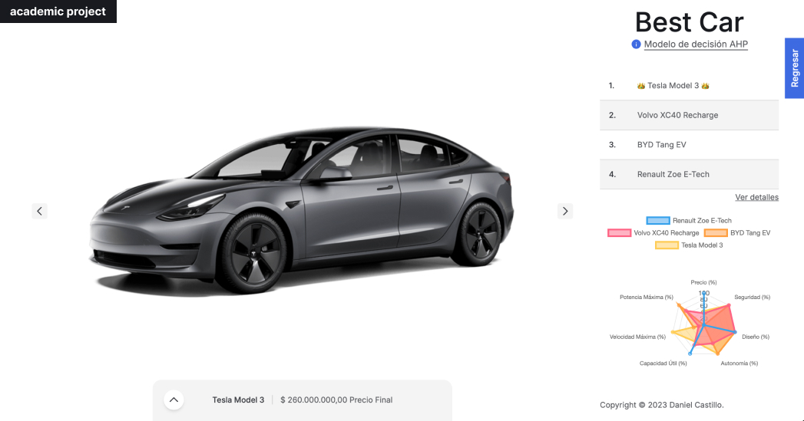

# AHP Calculator - Electric Vehicle Selection

**Autor:** Daniel Castillo Giraldo  
**Correo:** <dcastillogi@unal.edu.co>  
**Carrera:** Ingeniería de Sistemas y Computación  
**Universidad:** Universidad Nacional de Colombia  

## Descripción del Proyecto

Este proyecto, desarrollado para la asignatura **Introducción al Análisis de Decisiones**, consiste en una calculadora que emplea el método de **Jerarquía Analítica (AHP)** para la selección óptima de vehículos eléctricos. La herramienta permite a los usuarios comparar distintos modelos de vehículos eléctricos basándose en una serie de criterios clave, que incluyen:

- **Precio:** Costo del vehículo.
- **Seguridad:** Nivel de seguridad del vehículo, evaluado en una escala del 1 al 6.
- **Diseño:** Valoración del diseño estético y funcional del vehículo.
- **Autonomía:** Distancia máxima que el vehículo puede recorrer con una carga completa.
- **Capacidad Útil:** Capacidad de la batería del vehículo en kilovatios-hora (kWh).
- **Velocidad Máxima:** Velocidad máxima que el vehículo puede alcanzar en kilómetros por hora (km/h).
- **Potencia Máxima:** Potencia máxima del motor del vehículo en caballos de fuerza (hp).

La calculadora AHP proporciona un enfoque estructurado para la toma de decisiones, facilitando la evaluación de alternativas en función de estos múltiples factores y ayudando a identificar el vehículo eléctrico que mejor se ajusta a las necesidades del usuario.

## AHP

El método de **Jerarquía Analítica (AHP)** es una técnica de análisis de decisiones desarrollada por el matemático Thomas L. Saaty en la década de 1970. AHP se basa en la descomposición de un problema de decisión complejo en una jerarquía de criterios y subcriterios, que se comparan mediante matrices de comparación de pares. Estas matrices se utilizan para calcular los pesos relativos de los criterios y subcriterios, lo que permite determinar la importancia relativa de cada uno en la toma de decisiones.

Es importante tener en cuenta que, para los criterios donde un menor valor es preferible (como el precio), se debe utilizar un signo negativo en la matriz de comparación por pares.

## Datos de Vehículos

A continuación, se presentan los datos de los vehículos eléctricos evaluados, organizados por criterios y subcriterios:

### Vehículos Evaluados

| Vehículo        | Nombre Completo           |
|-----------------|---------------------------|
| **RENAULT**     | Renault Zoe E-Tech        |
| **VOLVO**       | Volvo XC40 Recharge       |
| **BYD**         | BYD Tang EV               |
| **TESLA**       | Tesla Model 3             |

### Criterios y Subcriterios

El análisis se realizó utilizando tres macrocategorías principales, cada una con sus subcriterios específicos:

| Macrocriterio | Subcriterios                   |
|---------------|--------------------------------|
| **Características Generales**      | Precio, Seguridad, Diseño      |
| **Batería**   | Autonomía, Capacidad Útil      |
| **Motor**     | Velocidad Máxima, Potencia Máxima |

### Características de los Vehículos por Criterio

A continuación, se muestran las características de cada vehículo, organizadas por los criterios evaluados:

#### Características Generales

| Vehículo   | Precio (COP) | Seguridad (1-6) | Diseño (1-10) |
|------------|--------------|-----------------|---------------|
| **RENAULT** | 169,990,000 | 1               | Elegido por el usuario |
| **VOLVO**   | 270,000,000 | 6               | Elegido por el usuario |
| **BYD**     | 329,900,000 | 6               | Elegido por el usuario |
| **TESLA**   | 260,000,000 | 6               | Elegido por el usuario |

#### Batería

| Vehículo   | Autonomía (km) | Capacidad Útil (kWh) |
|------------|----------------|----------------------|
| **RENAULT** | 390            | 52                  |
| **VOLVO**   | 460            | 69                  |
| **BYD**     | 500            | 108                 |
| **TESLA**   | 500            | 75                  |

#### Motor

| Vehículo   | Velocidad Máxima (km/h) | Potencia Máxima (hp) |
|------------|-------------------------|----------------------|
| **RENAULT** | 140                     | 135                  |
| **VOLVO**   | 160                     | 231                  |
| **BYD**     | 180                     | 268                  |
| **TESLA**   | 260                     | 138                  |